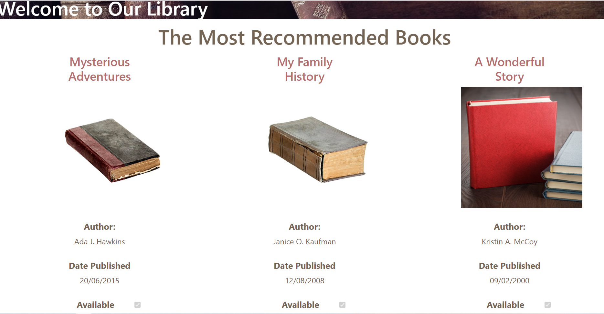

# Managing Security

1. **Nombres y apellidos:** Carola Casais Recondo 
2. **Fecha:** Jueves 10 de diciembre de 2020
3. **Resumen del Ejercicio:** EL objetivo es gestionar la seguridad.
4. **Dificultad o problemas presentados y como se resolvieron:** No hubo dificultades en este ejercicio.
